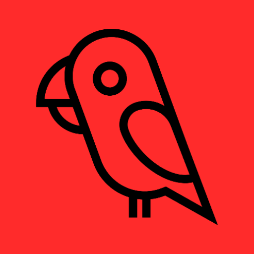

<div align="center">
  
  <h1 style="font-size: 28px; margin: 10px 0;">ArrMatey</h1>
  <p>A modern, all-in-one mobile client for managing your *arr stack. Built using KMP with native Jetpack Compose UI for Android and SwiftUI for iOS.</p>
</div>

[](LICENSE)
[](https://www.android.com)
[](https://www.apple.com/ios)
[](https://kotlinlang.org)
[](https://swift.org)

<a href="https://www.buymeacoffee.com/owenlejeune" target="_blank"></a>

## Features

### Multi-Instance Support
- Manage multiple Sonarr, Radarr, and Lidarr instances
- Quick instance switching
- Custom instance labels and configurations

### Library Management
- Browse your entire media library with list and grid views
- Search and filter by title, quality, monitored status
- Sort by name, date added, size, and more
- View detailed media information including:
  - Episode lists with file status
  - Season management
  - Quality profiles and custom formats
  - File sizes and storage information

### Interactive Search
- Manual search for releases
- Filter by quality, language, indexer, protocol
- View seeders, size, age, and custom format scores
- One-tap download with confirmation for rejected releases

### Calendar View
- View upcoming episodes and movie releases
- Switch between list and month views
- Filter by content type, monitored status, premieres/finales
- Scroll-to-today for easy navigation

### Activity Queue
- Real-time download monitoring
- View progress, ETA, and status
- Cancel downloads with blocklist options
- Detailed queue item information

### Advanced Features
- **Custom Headers**: Add custom HTTP headers per instance
- **Slow Instance Mode**: Configurable timeout for remote instances
- **Pull-to-refresh**: Update data across all screens
- **Material 3/Liquid Glass Design**: Beautiful, modern UI with dynamic theming on Android and Liquid Glass on iOS
- **Search Everywhere**: Unified search across your library

### Planned Features
- [ ] Tablet/Large screen support
- [ ] Home screen widgets
- [ ] Schedule notifications
- [ ] bulk library actions
- [ ] Additional instances types
  - [ ] Seer
  - [ ] Readarr/Chaptarr
  - [ ] Bazarr
  - [ ] Kapowarr
  - [ ] tautulli
  - [ ] prowlarr
- and more to come

## Screenshots

### Library Views
<table>
  <tr>
    <td></td>
    <td></td>
  </tr>
  <tr>
    <td align="center"><em>List View</em></td>
    <td align="center"><em>Grid View</em></td>
  </tr>
</table>

### Media Details
<table>
  <tr>
    <td></td>
    <td></td>
    <td></td>
    <td></td>
  </tr>
  <tr>
    <td align="center"><em>Series Details</em></td>
    <td align="center"><em>Movie Details</em></td>
    <td align="center"><em>Episode Details</em></td>
    <td align="center"><em>Artist Details</em></td>
  </tr>
</table>

### Calendar & Activity
<table>
  <tr>
    <td></td>
    <td></td>
    <td></td>
  </tr>
  <tr>
    <td align="center"><em>Calendar List</em></td>
    <td align="center"><em>Calendar Month</em></td>
    <td align="center"><em>Activity Queue</em></td>
  </tr>
</table>

## Getting Started

This is a Kotlin Multiplatform project targeting Android, iOS.

- [/composeApp](./composeApp/src) contains the Android application. This is where all Jetpack Compose and other Android-app specific code should go.

- [/iosApp](./iosApp/iosApp) contains iOS applications. This is where all SwiftUI and other iOS-app specific code should go

- [/shared](./shared/src) is for the code that will be shared between all targets in the project.
  The most important subfolder is [commonMain](./shared/src/commonMain/kotlin). Any code that is shared between projects (networking/database/viewmodel/data models, etc.) goes here. There are also [androidMain](./shared/src/androidMain/kotlin) and [iosMain](./shared/src/iosMain/kotlin) for shard code that targets a specifc platform.

### Build and Run Android Application

To build and run the development version of the Android app, build and run the composeApp target in AndroidStudio

### Build and Run iOS Application

To build and run the development version of the iOS app, build and run the iosApp target in AndroidStudio or open the [/iosApp](./iosApp) directory in Xcode and run it from there.

To build the app locally Xcode must be signed into an Apple Account:
```
Xcode → Settings → Accounts
```

Next, select the Apple Account's team for the `iosApp` target:
```
iosApp → Signing & Capabilities → Targets → iosApp -> Signing -> Team
```

### Adding Localized String

ArrMatey uses [moko-resources](https://github.com/icerockdev/moko-resources) for string resources across platforms. 
Any new strings should be added to strings.xml, or plurals.xml for plural strings. Build your targets, and new strings will be accessible using MR.strings

## Configuration

### Adding Your First Instance

1. Open the app and navigate to **Settings**
2. Tap **Add Instance**
3. Select your instance type (Sonarr/Radarr/Lidarr)
4. Enter your instance details:
  - **Label**: A friendly name for this instance
  - **Host**: Your instance URL (e.g., `http://192.168.1.100:8989`)
  - **API Key**: Found in your instance settings under General → Security
5. (Optional) Configure advanced settings:
  - **Slow Instance**: Enable for remote instances with higher latency
  - **Custom Timeout**: Set a custom timeout in seconds (default: 60s)
  - **Custom Headers**: Add additional HTTP headers if needed
6. Tap **Test Connection** to verify
7. Save your instance

### Custom Headers

Custom headers are useful for:

- Reverse proxy authentication
- Additional security headers
- Custom routing or load balancing

Example:

- Header: `X-Forwarded-For`
- Value: `192.168.1.1`

## Contributing

Contributions are welcome! Please feel free to submit a Pull Request.

### Development Guidelines

1. **Code Style**: Follow [Kotlin coding conventions](https://kotlinlang.org/docs/coding-conventions.html)
2. **Commits**: Use conventional commit messages
3. **Testing**: Add tests for new features
4. **Documentation**: Update README and code comments

### How to Contribute

1. Fork the repository
2. Create a feature branch (`git checkout -b feature/amazing-feature`)
3. Commit your changes (`git commit -m 'feat: add amazing feature'`)
4. Push to the branch (`git push origin feature/amazing-feature`)
5. Open a Pull Request

## Bug Reports
Found a bug? Please [open an issue](https://github.com/owenlejeune/ArrMatey/issues) with:
- A clear description of the problem
- Steps to reproduce
- Expected vs actual behavior
- Device/Android version
- Arr instance version (Sonarr/Radarr/Lidarr)

## License

This project is licensed under the MIT License - see the [LICENSE](LICENSE) file for details.

## Acknowledgments

- [Sonarr](https://sonarr.tv/) - Smart PVR for newsgroup and bittorrent users
- [Radarr](https://radarr.video/) - Movie collection manager
- [Lidarr](https://lidarr.audio/) - Music collection manager
- [Material Design 3](https://m3.material.io/) - Design system
- [Jetpack Compose](https://developer.android.com/jetpack/compose) - Modern UI toolkit
- [SwftUI](https://developer.apple.com/xcode/swiftui/) - Apple's declarative framework for building user interfaces
- [Kotlin Multiplatform](https://kotlinlang.org/docs/multiplatform.html) - Kotlin's cross-platform solution
